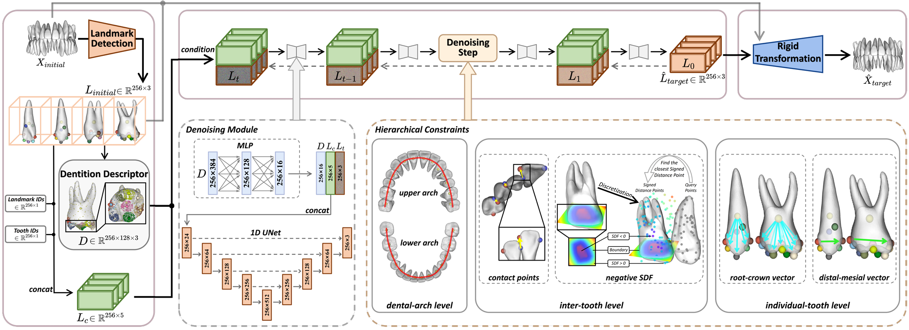

# CLIK-Diffusion: Clinical Knowledge-informed Diffusion Model for Tooth-Alignment

[Yulong Dou](https://douyl.github.io/), [Han Wu](https://hanwu.website/), [Changjian Li](https://enigma-li.github.io/), [Chen Wang](https://www.igiplab.com/members/166), Tong Yang, Min Zhu, [Dinggang Shen](https://idea.bme.shanghaitech.edu.cn/), and [Zhiming Cui](https://shanghaitech-impact.github.io/).

### [Paper](https://authors.elsevier.com/a/1lYg74rfPmLfAq) | [Dataset](https://github.com/ShanghaiTech-IMPACT/CLIK-Diffusion/blob/main/Data_Access_Agreement.pdf)

This is the official repository of our paper **CLIK-Diffusion: Clinical Knowledge-informed Diffusion Model for Tooth-Alignment** in **Medical Image Analysis (MedIA) 2025**. In this work, we formulate the complex problem of tooth alignment as a more manageable landmark transformation problem, which is further refined into a landmark coordinate generation task via diffusion model. To further encourage the integration of essential clinical knowledge, we design hierarchical constraints from three perspectives: dental-arch level, inter-tooth level, and individual-tooth level.




### Updates
- **[2025-08-05]** *Version of Record* of our paper is available online, see [Paper](https://authors.elsevier.com/a/1lYg74rfPmLfAq)!
- **[2025-07-25]** Dataset released!
- **[2025-07-25]** Code released!
- **[2025-07-22]** Our paper is accepted by *MedIA 2025*!


### Getting Started
First clone this repo. And then set up an environment and install required packages.

```python
git clone https://github.com/ShanghaiTech-IMPACT/CLIK-Diffusion-Clinical-Knowledge-informed-Diffusion-Model-for-Tooth-Alignment.git

conda create -n tooth python=3.8
conda activate tooth
pip install torch==1.10.0+cu113 torchvision==0.11.1+cu113
pip install -r requirements.txt
```

### Testing
We now only provide case-by-case code for testing. To test our model ——
* First download both checkpoints of landmark detection network and checkpoints of diffusion model from https://drive.google.com/drive/folders/1o9tVJ6p8Jbad3gu0ZUkX0tE5dp7Vkh9g?usp=sharing.
* Then put all five downloaded checkpoints into [`./Code/checkpoint`](./Code/checkpoint).
* We have prepared some data samples for you to start a quick test. The pre-orthodontic tooth meshes are stored in [`./Data`](./Data).
* Run the following command:
    ```python
    cd CLIK-Diffusion-Clinical-Knowledge-informed-Diffusion-Model-for-Tooth-Alignment
    python Code/infer.py -i "./Data/275" -o "./Output"
    # add argument "-v" if you want see the results of landmark detection network
    ``` 
* You will find the post-orthodontic tooth meshes which are predicted by our method in [`./Output`](./Output).

### Open Dataset
★ Our dataset is available for reserach purpose only. To apply for our *CLIK-Diffusion* dataset, please fill out the [Data Access Agreement](./Data_Access_Agreement.pdf) and send the **signed e-copy** to <u>Yulong Dou (email: douyl2023@shanghaitech.edu.cn)</u> and <u>Zhiming Cui (email: cuizhm@shanghaitech.edu.cn)</u>, as well as **CC your supervisor**. We will send you the dataset link and password when recieving the data access form.

### Citation

If you find this code or dataset useful, please cite our paper:

```BibTeX
@article{DOU2025103746,
title = {CLIK-Diffusion: Clinical Knowledge-informed Diffusion Model for Tooth Alignment},
journal = {Medical Image Analysis},
volume = {106},
pages = {103746},
year = {2025},
issn = {1361-8415},
doi = {https://doi.org/10.1016/j.media.2025.103746},
url = {https://www.sciencedirect.com/science/article/pii/S1361841525002932},
author = {Yulong Dou and Han Wu and Changjian Li and Chen Wang and Tong Yang and Min Zhu and Dinggang Shen and Zhiming Cui}
}
```